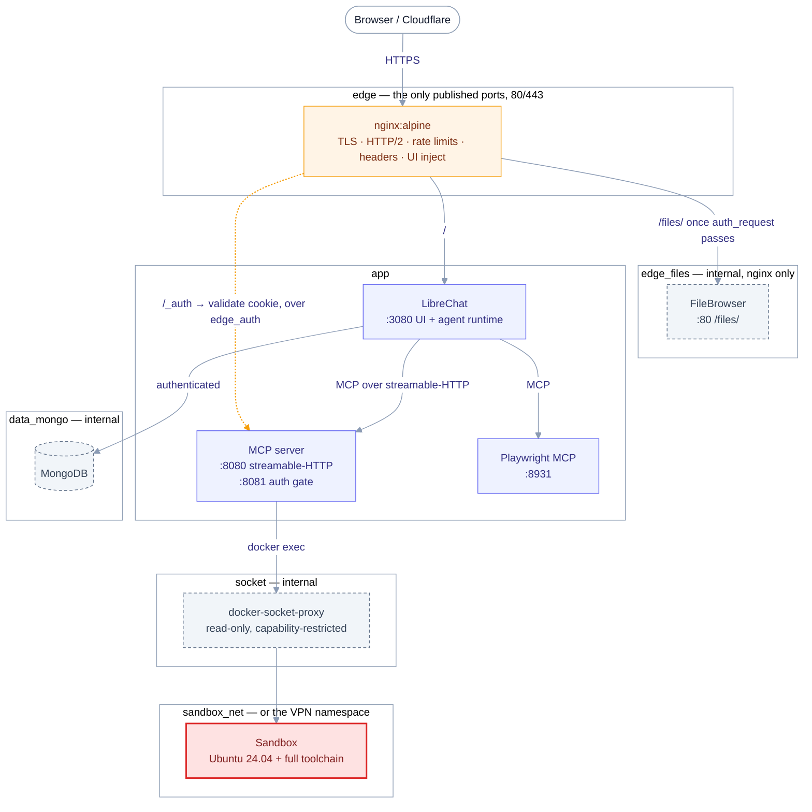
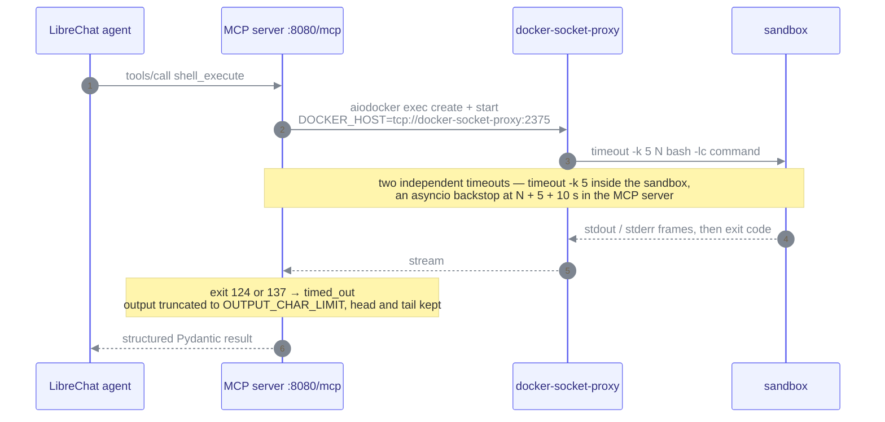

# Libre Box

**A self-hosted, security-hardened [LibreChat](https://github.com/danny-avila/LibreChat) stack that gives your AI agents a real Linux computer.**

Libre Box is a single–`docker compose` deployment that wraps LibreChat with a reverse proxy, browser automation, a web file manager, and — its centerpiece — a custom **Model Context Protocol (MCP) server** written in Python 3.13. That MCP server exposes shell, interactive sessions, background processes, and file operations backed by a heavyweight, fully-provisioned Ubuntu **sandbox** container. From any LibreChat conversation or agent, the model gets a genuine, persistent workstation preloaded with a vast development and security toolchain.

<p>
  
  
  
  
  
</p>

---

## Table of Contents

- [Why Libre Box](#why-libre-box)
- [Architecture](#architecture)
  - [Services](#services)
  - [Network segmentation](#network-segmentation)
  - [Request & authentication flow](#request--authentication-flow)
  - [Where code actually runs](#where-code-actually-runs)
- [The MCP server](#the-mcp-server)
  - [Tool reference](#tool-reference)
- [The sandbox](#the-sandbox)
  - [Pinned versions](#pinned-versions)
  - [What is installed](#what-is-installed)
- [The agent prompt](#the-agent-prompt)
  - [Using and adapting it](#using-and-adapting-it)
- [Security model](#security-model)
- [Prerequisites](#prerequisites)
- [Quick start (local development)](#quick-start-local-development)
- [Production deployment](#production-deployment)
- [Configuration reference](#configuration-reference)
  - [Root `.env`](#root-env)
  - [`librechat/.env`](#librechatenv)
  - [`librechat/librechat.yaml`](#librechatlibrechatyaml)
  - [Adding a model provider endpoint](#adding-a-model-provider-endpoint)
- [VPN egress (optional)](#vpn-egress-optional)
- [Using Libre Box](#using-libre-box)
- [Operations (Makefile)](#operations-makefile)
- [Troubleshooting](#troubleshooting)
- [Acknowledgements](#acknowledgements)

---

## Why Libre Box

Most self-hosted chat UIs stop at text. Libre Box is built for **agentic** work — the model doesn't just talk about running a command, it runs it, on a machine that persists state across turns:

- 🖥️ **A real computer, not a toy REPL.** Agents get `bash`, interactive TTY sessions, detached background processes, and a full filesystem — all inside an isolated container.
- 🧰 **Batteries wildly included.** The sandbox ships dozens of languages and runtimes, a complete data/ML Python stack, document and media pipelines, database and cloud clients, and an extensive security toolkit.
- 🧭 **Opinionated out of the box.** A production-grade [example system prompt](#the-agent-prompt) ships with the stack, so the agent actually *uses* the machine — topic-scoped workspaces, background jobs, resumable work, and artifacts handed back as links.
- 🔒 **Hardened by default.** TLS everywhere, segmented internal networks, dropped Linux capabilities, a read-only Docker-socket proxy, workspace path-traversal guards, rate limiting, and single-sign-on between LibreChat and the file manager.
- 🧩 **Composable.** Browser automation (Playwright), hosted integrations (Composio), and web search (Serper) are wired in as first-class MCP servers alongside LibreChat's own agents, skills, subagents, and scheduled runs.
- 🌐 **Egress control.** An optional WireGuard overlay routes all sandbox and browser traffic through a VPN.

---

## Architecture

Libre Box is a set of small, single-purpose containers orchestrated by `docker-compose.yml`. Only **nginx** publishes ports; everything else communicates over private Docker networks.



The shared workspace is deliberately left out here — it spans every tier and gets [its own section](#where-code-actually-runs). Across all diagrams in this README: `([…])` is an external actor, `[…]` a service container and `[(…)]` a database; amber marks the public edge, indigo the application tier, slate-dashed internal machinery with no route from outside (`internal` networks, brokered access, foundation modules), red the deliberately-privileged sandbox, and a dashed arrow the control plane rather than the data plane.

### Services

| Service                 | Image                                     | Role                                                                                                        | Networks                          | Published   | Memory |
|-------------------------|-------------------------------------------|-------------------------------------------------------------------------------------------------------------|-----------------------------------|-------------|--------|
| **mongodb**             | `mongo` (pinned by digest)                | LibreChat database, started with `--auth`                                                                   | `data_mongo`                      | —           | 512M   |
| **librechat**           | `ghcr.io/danny-avila/librechat:latest`    | Chat UI and agent runtime (listens on `:3080`)                                                              | `edge`, `app`, `data_mongo`       | —           | 1G     |
| **nginx**               | `nginx:alpine`                            | TLS termination, reverse proxy, rate limiting, security headers, FileBrowser auth gate, LibreChat UI inject | `edge`, `edge_auth`, `edge_files` | **80, 443** | 256M   |
| **sandbox**             | *built* `./services/sandbox`              | The agent's execution environment (Ubuntu 24.04 + toolchain)                                                | `sandbox_net`                     | —           | 8G     |
| **docker-socket-proxy** | `tecnativa/docker-socket-proxy:latest`    | Capability-restricted gateway to the Docker socket (mounted read-only)                                      | `socket`                          | —           | 64M    |
| **mcp**                 | *built* `./services/mcp`                  | Custom MCP server: shell / session / background / file / system tools, plus the JWT auth gate               | `edge_auth`, `app`, `socket`      | —           | 512M   |
| **filebrowser**         | `filebrowser/filebrowser:latest`          | Web file manager over the shared workspace, proxy-authenticated                                             | `edge_files`                      | —           | 256M   |
| **playwright**          | `mcr.microsoft.com/playwright/mcp:latest` | Headless Chromium browser-automation MCP (`--isolated`, per-session contexts) on `:8931`                    | `app`                             | —           | 1G     |
| **vpn** *(overlay)*     | `qmcgaw/gluetun:latest`                   | Optional WireGuard egress for sandbox + playwright                                                          | `app` (alias `playwright`)        | —           | 512M   |

Every service sets `restart: unless-stopped`, a memory limit, and a graceful `stop_grace_period`, and all but the intentionally-privileged `sandbox` add `no-new-privileges`. The `sandbox` additionally carries CPU (`4`) and PID (`4096`) limits.

MongoDB, the sandbox, the MCP server, FileBrowser and (in the overlay) the VPN all declare healthchecks; `mcp` waits for the sandbox to report **healthy** before it starts, and `librechat` waits for MongoDB. Named volumes: `mongo_data`, `librechat_images`, `librechat_uploads`, `filebrowser_db`.

### Network segmentation

Traffic is compartmentalized so a compromise of one tier cannot reach the others:

| Network       | Internal? | Members                    | Purpose                                               |
|---------------|-----------|----------------------------|-------------------------------------------------------|
| `edge`        | no        | nginx, librechat           | Public entrypoint: nginx to the LibreChat UI          |
| `edge_auth`   | **yes**   | nginx, mcp                 | `auth_request` subrequests to the JWT auth gate       |
| `edge_files`  | **yes**   | nginx, filebrowser         | The only route to FileBrowser, and it starts at nginx |
| `app`         | no        | librechat, mcp, playwright | Inter-service application traffic                     |
| `data_mongo`  | **yes**   | mongodb, librechat         | Database access only                                  |
| `socket`      | **yes**   | docker-socket-proxy, mcp   | Brokered Docker access only                           |
| `sandbox_net` | no        | sandbox                    | Sandbox egress (replaced by the VPN in the overlay)   |

### Request & authentication flow

1. A browser reaches **nginx** over HTTPS. Requests whose `Host` does not match `DOMAIN` hit the default server and get an immediate connection reset (`444`, plus `ssl_reject_handshake`); plain HTTP is redirected to HTTPS, with an ACME webroot carve-out at `/.well-known/acme-challenge/` for certificate renewal.
2. `/` is proxied to **LibreChat** (`burst=100`), with WebSocket upgrade and 1-hour proxy read/send timeouts for streaming. `/api/auth/` gets the stricter login rate limit. nginx also blanks the upstream `Accept-Encoding` and `sub_filter`s `<script src="/librebox/inject.js" defer>` in before `</head>`; re-compression is handled by nginx `gzip`.
3. That script (`nginx/assets/inject.js`, served from `/librebox/inject.js`) adds a **Files** button to LibreChat's left rail — inserted at the top of the bottom cluster that holds `data-testid="nav-user"`, opening `/files/` in a new tab. A `MutationObserver` re-inserts it after client-side re-renders.
4. `/files/` is proxied to **FileBrowser**, but first nginx issues an `auth_request` sub-request to the MCP **auth gate** (`mcp:8081/auth/validate`). The gate reads LibreChat's `refreshToken` / `token` cookies, verifies them (HS256, `exp` required) with the **shared `JWT_SECRET` / `JWT_REFRESH_SECRET`**, and returns the user id in `X-Auth-User`; on failure nginx redirects to `/login`. FileBrowser trusts that header via proxy auth — so **only logged-in LibreChat users can reach the file manager**, with no separate password.
5. Inside LibreChat, agents call the **LibreBoxMCP** server over streamable-HTTP (`mcp:8080/mcp`). The MCP server executes shell work inside the sandbox by issuing `docker exec` calls **through the socket proxy** — it never touches the real Docker socket.

### Where code actually runs

Two different execution surfaces share one filesystem. `./data` on the host is bind-mounted into the MCP server, the sandbox (`/root/data`), Playwright (`/home/node/data`) and FileBrowser (`/srv`), so everything sees the same tree.

| Tool family                                        | Executes in                                                      | Reach                                                                          |
|----------------------------------------------------|------------------------------------------------------------------|--------------------------------------------------------------------------------|
| `shell_execute`, `shell_session_*`, `background_*` | the **sandbox** container, via `docker exec` through the proxy   | the whole sandbox — full toolchain, full filesystem, its own network namespace |
| `file_*`, `directory_*`                            | the **MCP** container itself (`rg` and `fd` are installed there) | only `/root/data`, enforced by `PathResolver`                                  |

A file written with `file_write` is immediately visible to `shell_execute`, to Playwright's screenshot output, and in FileBrowser. Background-process logs are the exception: they live at `BACKGROUND_LOG_DIR` (`/root/.box/logs`) **inside the sandbox**, not in the shared workspace.

---

## The MCP server

`services/mcp` is a strict, fully type-hinted Python 3.13 application built on the [MCP Python SDK](https://github.com/modelcontextprotocol/python-sdk) (`MCPServer`), `starlette`/`fastapi`/`uvicorn`, `aiodocker`, `pydantic` + `pydantic-settings`, `pyjwt`, and `loguru`. It runs two ASGI apps behind a request-ID middleware:

- **`:8080`** — the MCP streamable-HTTP server mounted at `/mcp`, plus a `/healthz` probe. A `TransportSecuritySettings` allowlist restricts the accepted `Host` headers to `mcp:*`, `localhost:*` and `127.0.0.1:*`.
- **`:8081`** — the FileBrowser auth gate (FastAPI with docs disabled): `GET /auth/validate` and `GET /healthz`.

Every shell-family tool call travels the same path, and never reaches Docker directly:



### Tool reference

All tools are registered under the MCP server name **`libre-box`** (`LibreBoxMCP` in LibreChat). Results are structured Pydantic models; long output is truncated to `OUTPUT_CHAR_LIMIT`, keeping the head and the tail with a `[... N chars truncated ...]` marker in between.

<details open>
<summary><b>Shell</b> — one-shot commands</summary>

| Tool            | Description                                                                                                                                                                                                           |
|-----------------|-----------------------------------------------------------------------------------------------------------------------------------------------------------------------------------------------------------------------|
| `shell_execute` | Run a command via `bash -lc` under `timeout -k`; returns stdout, stderr, exit code, duration, and truncation/timeout flags. Args: `command`, `cwd` (default `/root/data`), `timeout` (default `600`, 1–86400), `env`. |

Because commands run as **login** shells, `/etc/profile.d/10-toolchains.sh` is sourced every time and the full `/opt` toolchain is on `PATH`.

</details>

<details>
<summary><b>Interactive sessions</b> — persistent stateful shells</summary>

| Tool                       | Description                                                                                                                                                                                                            |
|----------------------------|------------------------------------------------------------------------------------------------------------------------------------------------------------------------------------------------------------------------|
| `shell_session_create`     | Open a persistent interactive `bash` session (TTY) that keeps cwd, environment, and shell state. Args: `cwd` (default `/root/data`), `env`.                                                                            |
| `shell_session_execute`    | Run a command in a session; tracks the resulting cwd and returns partial output on timeout. Args: `session_id`, `command`, `timeout` (default `600`, 1–86400).                                                         |
| `shell_session_send_input` | Answer an interactive prompt by writing raw text to a session's stdin; reports the exit code once the waiting command finishes. Args: `session_id`, `text`, `add_newline` (default `true`), `timeout` (default `2.0`). |
| `shell_session_close`      | Terminate a session and free its resources. Args: `session_id`.                                                                                                                                                        |

Sessions use marker-framed command completion, strip ANSI escapes and carriage returns, cap their buffer at 500 000 characters, are health-checked at creation with a 10-second probe, and are reaped every 60 seconds once idle longer than `SESSION_IDLE_TTL_SECONDS`. If a session's underlying shell stream dies it is detected and evicted immediately — the call surfaces a clear `SessionBrokenError` instead of hanging on an empty failure. Each command is submitted as a single shell parse unit, so the completion marker is consumed by the shell before the command starts and never reaches the stdin of a program that reads it: a command blocked on input reports `timed_out` with its prompt as partial output, and `shell_session_send_input` then delivers the answer and returns `completed` with the exit code.

</details>

<details>
<summary><b>Background processes</b> — long-running jobs</summary>

| Tool                | Description                                                                                                                                                                     |
|---------------------|---------------------------------------------------------------------------------------------------------------------------------------------------------------------------------|
| `background_start`  | Launch a detached process (`setsid`) whose output streams to a log file under `BACKGROUND_LOG_DIR`; returns a process id. Args: `command`, `cwd` (default `/root/data`), `env`. |
| `background_status` | Report whether a process is running or exited, with its exit code. Args: `process_id`.                                                                                          |
| `background_tail`   | Return recent output — last *N* lines, or a byte range for incremental streaming via `next_offset`. Args: `process_id`, `lines` (default `200`), `offset_bytes`.                |
| `background_stop`   | Signal the process group and wait, escalating to `KILL` after a timeout. Args: `process_id`, `signal` (default `TERM`), `timeout` (default `10`).                               |
| `background_wait`   | Block until the process exits (or timeout), then return status and a tail of output. Args: `process_id`, `timeout` (default `600`).                                             |
| `background_list`   | List every tracked background process with its status. No args.                                                                                                                 |

Accepted signals: `CONT`, `HUP`, `INT`, `KILL`, `QUIT`, `STOP`, `TERM`, `USR1`, `USR2`. Bash traps record a `128+n` exit code for signal-terminated jobs, so `background_status` still reports one after a `TERM` or `INT`. The reported `pid` is the `setsid` session-group leader, not the command's own PID. The process registry is held in memory, so restarting the MCP container forgets existing jobs (the logs and the processes themselves survive inside the sandbox).

</details>

<details>
<summary><b>Files</b> — workspace-confined I/O</summary>

| Tool               | Description                                                                                                                                                                                                                                                                  |
|--------------------|------------------------------------------------------------------------------------------------------------------------------------------------------------------------------------------------------------------------------------------------------------------------------|
| `file_read`        | Read a text file with 1-based line-number prefixes; binary files are detected (NUL byte in the first 4 KiB) and returned without content. Args: `path`, `offset` (default `0`), `limit` (default `2000`), `encoding` (default `utf-8`).                                      |
| `file_write`       | Write a file, overwriting and optionally creating parent directories. Args: `path`, `content`, `create_dirs` (default `true`), `encoding` (default `utf-8`).                                                                                                                 |
| `file_edit`        | Exact-string replace; requires a unique match unless `replace_all` is set. Args: `path`, `old_string`, `new_string`, `replace_all` (default `false`), `encoding` (default `utf-8`).                                                                                          |
| `file_search`      | Search with **ripgrep** (`content` mode, regex inside files, optional `glob` filter) or **fd** (`files` mode, glob against file names, e.g. `*.txt`). Args: `pattern`, `path` (default `.`), `glob`, `mode` (default `content`), `max_results` (default `250`, max `10000`). |
| `directory_create` | Create a directory (with parents by default), succeeding if it already exists. Args: `path`, `parents` (default `true`).                                                                                                                                                     |
| `directory_tree`   | Recursive tree with per-entry sizes, depth limit, and optional hidden entries. Args: `path` (default `.`), `max_depth` (default `5`, max `20`), `show_hidden` (default `true`), `show_sizes` (default `true`).                                                               |

All file paths are resolved through a **`PathResolver`** that rejects anything escaping the `/root/data` workspace (`PathTraversalError`); relative paths are resolved against it.

</details>

<details>
<summary><b>System</b> — helpers</summary>

| Tool       | Description                                                                                                                          |
|------------|--------------------------------------------------------------------------------------------------------------------------------------|
| `sleep`    | Pause for *N* seconds (useful between polling steps). Args: `seconds`. Clamped server-side to `DEFAULT_COMMAND_TIMEOUT_SECONDS`.     |
| `time_now` | Current time as ISO 8601 + epoch + human string, in a requested IANA timezone (falls back to UTC). Args: `timezone` (default `UTC`). |

</details>

---

## The sandbox

`services/sandbox` builds a large Ubuntu 24.04 image that is the agent's workstation. Toolchains live under `/opt` with a `profile.d` entry that puts them on `PATH` and sets `CARGO_HOME`, `RUSTUP_HOME`, `GOROOT`, `GOPATH`, `PYENV_ROOT`, `PIPX_HOME`, `DOTNET_ROOT`, `XDG_CACHE_HOME`, `HISTFILE` and the Chrome/Puppeteer paths. The shared workspace is mounted at `/root/data` (also the image `WORKDIR`). The image is assembled from numbered install scripts in `services/sandbox/scripts/` so it is easy to audit and extend, with all pinned versions centralized in `services/sandbox/config/versions.env`.

The container runs `tini` → `entrypoint.sh`, which creates `/root/data`, `/root/.box/logs` and `/opt/state`, touches the readiness file `/root/.box/ready`, and then `sleep infinity`. The Docker `HEALTHCHECK` polls that file every 10 seconds — this is the gate the `mcp` service waits on.

> ⚠️ **This image is big.** A full build downloads and installs many gigabytes (TeX Live, PyTorch/TensorFlow, Ghidra, wordlists, and more) and can take a long time on the first run. Budget ample disk and CPU.

### Pinned versions

Everything below is set in [`services/sandbox/config/versions.env`](services/sandbox/config/versions.env):

| Languages & runtimes |           | Infra & CLI |          | Security  |                       |
|----------------------|-----------|-------------|----------|-----------|-----------------------|
| .NET SDK channel     | `10.0`    | age         | `1.3.2`  | apktool   | `3.0.3`               |
| Go                   | `1.27.1`  | D2          | `0.8.2`  | Chisel    | `1.12.0`              |
| OpenJDK              | `25`      | duf         | `0.9.1`  | Ghidra    | `12.1.3` (`20260605`) |
| Julia                | `1.12.7`  | Helm        | `4.2.4`  | gitleaks  | `8.30.1`              |
| Node.js              | `24.20.0` | shfmt       | `3.14.0` | jadx      | `1.5.6`               |
| PowerShell           | `7.6.5`   | sops        | `3.13.3` | ligolo-ng | `0.9.1`               |
| Rust channel         | `stable`  | OpenTofu    | `1.12.6` | Sliver    | `1.7.7`               |
|                      |           | usql        | `0.21.4` |           |                       |

The Kali repository is added but pinned at apt priority `50` (`KALI_PIN_PRIORITY`), so Ubuntu packages always win unless a package exists only in Kali.

### What is installed

The inventory below reflects the install scripts under `services/sandbox/scripts/`; consult them for the authoritative, per-package list.

<details>
<summary><b>Base system, shells & fonts</b></summary>

**Build & compilers:** build-essential, gcc, g++, make, cmake, pkg-config.
**Version control & remote:** git, git-lfs, openssh-client, rsync.
**Networking & crypto:** curl, wget, openssl, gnupg, ca-certificates.
**Archives:** unzip, zip, xz-utils, zstd, bzip2.
**Shells & editors:** bash, bash-completion, zsh, fish, tmux, neovim, vim, nano, direnv.
**System utils:** procps, psmisc, lsof, strace, file, less, tini, locales (en_US.UTF-8), tzdata, lsb-release, apt-transport-https, software-properties-common.
**Fonts (via fontconfig):** Noto core, Noto CJK, Noto color-emoji, Noto extra, DejaVu, Liberation, Liberation 2, FreeFont, Fira Code, JetBrains Mono.

</details>

<details>
<summary><b>Languages & runtimes</b></summary>

**Python:** CPython 3 (`python3-dev`, `python3-venv`, `python3-pip`) with `pipx`, `uv`, `poetry`, and `pyenv`.
**Node.js:** 24.20.0 with `corepack`, `npm`, `pnpm`, and `yarn`; plus `bun` and `deno`.
**Go:** 1.27.1.
**Rust:** stable toolchain via `rustup`, with `cargo-binstall`.
**Java:** OpenJDK 25 with Maven and Gradle.
**.NET:** SDK 10.0.
**PowerShell:** 7.6.5.
**Julia:** 1.12.7.
**Ruby:** `ruby-full` with `rbenv`.
**PHP:** `php-cli` (+ `curl` and `mbstring` extensions).
**Perl / Lua / R:** Perl, Lua 5.4 (+ `luarocks`), and R (`r-base`).

</details>

<details>
<summary><b>Data & ML (Python venv at <code>/opt/pytools</code>)</b></summary>

**Core packaging:** pip, setuptools, wheel.
**Deep learning:** torch (CPU build), tensorflow-cpu, onnxruntime.
**Numerics & dataframes:** numpy, pandas, polars, scipy, statsmodels, pyarrow, duckdb, sqlite-utils.
**Classic ML:** scikit-learn, xgboost, lightgbm, catboost.
**NLP:** transformers, sentence-transformers, spaCy, NLTK (with punkt + stopwords data), gensim.
**Plotting:** matplotlib, seaborn, plotly, altair.
**Images & vision:** Pillow, OpenCV (headless), scikit-image, imageio.
**OCR:** easyocr, paddleocr.
**HTTP & scraping:** requests, httpx, aiohttp, BeautifulSoup4, lxml, parsel, selectolax, readability-lxml, scrapy.
**Databases:** SQLAlchemy, SQLModel, psycopg, PyMySQL, redis, pymongo.
**Notebooks:** IPython, JupyterLab.
**Documents:** openpyxl, python-docx, python-pptx, XlsxWriter, reportlab, fpdf2, tabulate, pikepdf.
**Audio:** pydub, mutagen.

</details>

<details>
<summary><b>CLI, docs, media & data</b></summary>

**Modern CLI:** fd, bat, fzf, ripgrep, eza, zoxide, git-delta, htop, btop, ncdu, tree, du-dust, procs, jq, yq, dasel, duf, shfmt, shellcheck, httpie, xh, hyperfine, aria2, parallel, pv, entr, moreutils, universal-ctags, tealdeer (tldr), jwt-cli, websocat.
**Node/TS tooling:** TypeScript, ts-node, Prettier, ESLint.
**Docs & diagrams:** pandoc, TeX Live (full), latexmk, LibreOffice, Typst, Graphviz, PlantUML, D2, Mermaid CLI, Marp, decktape, headless Chrome (`chrome-no-sandbox`), poppler-utils, qpdf, ghostscript, pdftk (pdftk-java), mupdf-tools, img2pdf, wkhtmltopdf.
**Media & OCR:** ffmpeg, ImageMagick, GraphicsMagick, libvips, Tesseract (eng, rus, osd), exiftool, Inkscape, rsvg-convert (librsvg), potrace, optipng, jpegoptim, pngquant, gifsicle, webp, sox, libsndfile, ocrmypdf, weasyprint.
**Data & prompt CLIs:** csvkit, visidata, yt-dlp, `llm`, `ttok`, `files-to-prompt`, `repomix`.
**Automation & lint:** Ansible, ansible-lint, yamllint.

</details>

<details>
<summary><b>Databases & cloud/infra</b></summary>

**DB clients:** PostgreSQL, MariaDB/MySQL, Redis, SQLite, `mongosh` + MongoDB tools, `usql` (+ client dev headers: libpq, libmysqlclient, unixODBC).
**Cloud & infra:** Docker CLI + Compose, skopeo, buildah, kubectl, Helm, Kustomize, k9s, Terraform, OpenTofu, Vault, Packer, AWS CLI, `sops`, `age`.

</details>

<details>
<summary><b>Security & offensive tooling</b> (Kali repo pinned at low priority)</summary>

**Recon/scanning:** nmap, ncat, masscan, rustscan, naabu, subfinder, amass, assetfinder, waybackurls, gau, hakrawler, katana, theHarvester, recon-ng, dnsx, dnsrecon, dnsenum, fierce, sublist3r, whois, dig (dnsutils).
**Networking & sniffing:** tcpdump, tshark, termshark, ngrep, netcat-openbsd, rlwrap, arp-scan, arping, fping, hping3, mtr, ethtool, iproute2, net-tools, nftables, iptables.
**Web:** nuclei, httpx (as `httpx-pd`), ffuf, feroxbuster, gobuster, wfuzz, dirsearch, sqlmap, nikto, whatweb, wafw00f, wpscan, commix, arjun, droopescan.
**Exploitation:** Metasploit Framework, exploitdb (searchsploit).
**Credentials & AD:** hydra, medusa, ncrack, patator, john, hashcat, hashid, name-that-hash, cewl, crunch, impacket, netexec, evil-winrm, responder, enum4linux-ng, smbmap, certipy, coercer, lsassy, pypykatz, bloodhound.py, ldapdomaindump.
**RE & forensics:** radare2, Ghidra, jadx, apktool, binwalk, foremost, scalpel, volatility3, sleuthkit, steghide, stegseek, zsteg, outguess, ssdeep, fcrackzip, pdfcrack, xxd, hexedit, upx, gdb, ltrace, Frida.
**C2, tunneling & MITM:** Sliver, Chisel, ligolo-ng (agent only, as `ligolo-agent`), proxychains, tor, torsocks, socat, bettercap, ettercap.
**Supply-chain & secrets:** trivy, grype, syft, gitleaks, checkov, prowler, ScoutSuite.
**OSINT:** sherlock, maigret, holehe.
**Wordlists:** SecLists, PayloadsAllTheThings, fuzzdb, RockYou, and the Kali `wordlists` metapackage.

</details>

---

## The agent prompt

The MCP server and the sandbox give the model *capability*; a system prompt gives it *policy*. A model handed a shell and no instructions still answers most questions as plain text, so this policy layer is the third component of the stack rather than a nicety — it is what turns "you have a computer" into an operating discipline: where files go, how results are handed back, when to background a job, and how work survives a truncated tool call.

[`agent/EXAMPLE_PROMPT.md`](agent/EXAMPLE_PROMPT.md) is that policy layer, shipped as a worked example. It is not a fixed contract — treat it as a template to copy verbatim on day one and reshape as your needs sharpen.

### Using and adapting it

Create an Agent in LibreChat, enable the `LibreBoxMCP` server (required — it is the sandbox), and paste the example into the Agent's **Instructions** field. The prompt also anticipates the two web-facing servers it names — `Serper` (web search) and `Playwright` (browser automation) — so enable those if you want the agent to reach the web; `Composio` (hosted integrations) is wired in too, though this example doesn't speak to it. Nothing else is required — the prompt is plain Markdown and assumes only the tools this stack already provides.

Because it is an example, expect to edit it: rewrite the persona, tighten the tone, or drop sections you don't want. Three things are worth keeping in sync if you change the stack itself:

---

## Security model

| Control                      | How                                                                                                                                                                                                                                                                                                                                                                  |
|------------------------------|----------------------------------------------------------------------------------------------------------------------------------------------------------------------------------------------------------------------------------------------------------------------------------------------------------------------------------------------------------------------|
| **TLS**                      | TLS 1.2/1.3 only, modern cipher suite, HSTS (2 years, `includeSubDomains`), session tickets off, 1-day session timeout.                                                                                                                                                                                                                                              |
| **Edge hardening**           | Security headers (`X-Content-Type-Options`, `X-Frame-Options: SAMEORIGIN`, `Referrer-Policy`, `Permissions-Policy`, CSP **report-only**), `server_tokens off`, unknown-host reset (`444` + `ssl_reject_handshake`).                                                                                                                                                  |
| **Rate & connection limits** | 30 r/s general (burst 100), 5 r/s on `/api/auth/` (burst 10), 50 concurrent connections per IP; `429` on breach.                                                                                                                                                                                                                                                     |
| **Real client IP**           | Cloudflare IPv4/IPv6 ranges trusted for `CF-Connecting-IP`.                                                                                                                                                                                                                                                                                                          |
| **Least privilege**          | `no-new-privileges` on every service except the deliberately-privileged sandbox; nginx, mcp, and filebrowser drop **all** capabilities (mcp re-adds none; nginx keeps `CHOWN`/`NET_BIND_SERVICE`/`SETGID`/`SETUID`, filebrowser keeps `DAC_OVERRIDE`/`NET_BIND_SERVICE` so root-owned agent output stays manageable).                                                |
| **Brokered Docker access**   | The MCP server reaches Docker only via a capability-restricted `docker-socket-proxy` (socket mounted `:ro`, container root filesystem `read_only` with tmpfs `/run` and `/tmp`): it enables only `CONTAINERS`/`EXEC`/`INFO`/`PING`/`POST`/`VERSION`, disabling `IMAGES`/`NETWORKS`/`VOLUMES`/`SERVICES`/`SWARM`/`TASKS`.                                             |
| **Network isolation**        | Every backend shares a network only with the service that must reach it: FileBrowser sits alone with nginx on `edge_files`, the auth gate on `edge_auth`, and both — like `data_mongo` and `socket` — are marked `internal` (no external route). LibreChat cannot address `filebrowser:80`, and the MCP server cannot either. No service but nginx publishes a port. |
| **Workspace confinement**    | MCP file tools resolve every path and reject traversal outside `/root/data`.                                                                                                                                                                                                                                                                                         |
| **MCP transport allowlists** | The MCP server only accepts a `Host` of `mcp`, `localhost` or `127.0.0.1`; LibreChat only dials MCP addresses on its `mcpSettings.allowedAddresses` list (`mcp:8080`, `playwright:8931`, `connect.composio.dev`); Playwright MCP itself only accepts `Host: playwright:8931`.                                                                                        |
| **SSO for the file manager** | FileBrowser publishes no port, runs with `--auth.method=proxy --auth.header=X-Auth-User`, and shares a network with nothing but nginx — which always overwrites `X-Auth-User` with the auth gate's answer, so the header cannot be forged from another container. Its bootstrap admin account is created with a random 16-byte password.                             |
| **Secrets**                  | All credentials come from `.env` files that are git-ignored; only `*.example` templates are committed. `vpn/*.conf` and `nginx/certs/*` are ignored too.                                                                                                                                                                                                             |

> The sandbox itself is intentionally powerful (it holds `NET_ADMIN`/`NET_RAW`/`SYS_PTRACE` for the security toolchain and runs without `no-new-privileges`). Treat it as a privileged blast-radius: keep it on an isolated host/network, and consider the [VPN overlay](#vpn-egress-optional) to control its egress.

---

## Prerequisites

- **Docker Engine** with the **Compose v2** plugin (`docker compose`) and BuildKit (the sandbox build uses a cache mount).
- A host with generous resources. Service memory limits total roughly **12 GB**; the sandbox alone is capped at 8 GB / 4 CPUs. **14 GB+ RAM** and tens of gigabytes of free disk are recommended.
- `git`, `make` and `openssl` (for the convenience targets and cert/secret generation).
- For production: a **domain name**, DNS pointing at the host, and either real TLS certificates or a certbot workflow.
- API keys for the model/search providers you intend to use (see [Configuration reference](#configuration-reference)).

---

## Quick start (local development)

```bash
# 1. Clone
git clone https://github.com/Kirill-Vaa/Libre-Box.git
cd Libre-Box

# 2. Create env files from templates
cp .env.example .env
cp librechat/.env.example librechat/.env

# 3. Generate secrets (fill the REPLACE_WITH_* placeholders)
openssl rand -hex 32   # -> JWT_SECRET
openssl rand -hex 32   # -> JWT_REFRESH_SECRET
openssl rand -hex 32   # -> CREDS_KEY   (32 bytes / 64 hex chars)
openssl rand -hex 16   # -> CREDS_IV    (16 bytes / 32 hex chars)
openssl rand -hex 24   # -> MONGODB_PASSWORD

# 4. For local dev, set DOMAIN=localhost in .env and add at least one model provider
#    key in librechat/.env (OPENROUTER_API_KEY works out of the box).

# 5. Build and start (auto-creates data/ + logs/ directories and a self-signed cert)
make up

# 6. Follow the build/startup logs (the sandbox image build is large)
make logs
```

Then open **https://localhost** (accept the self-signed certificate warning).

**Creating the first user.** Registration is disabled by default (`ALLOW_REGISTRATION=false`). To create your account, temporarily set `ALLOW_REGISTRATION=true` in `librechat/.env`, run `docker compose up -d librechat`, register in the UI, then set it back to `false` and restart.

> **Consistency note:** `JWT_SECRET` and `JWT_REFRESH_SECRET` live in `librechat/.env`, which the MCP container also loads via `env_file` — so the auth gate and LibreChat automatically share the same secrets. If neither is set, the MCP server logs a `critical` line at startup and the auth gate rejects every request.

---

## Production deployment

1. **Point DNS** for your `DOMAIN` at the host and set `DOMAIN` in `.env`. Set `DOMAIN_CLIENT`/`DOMAIN_SERVER` to `https://your.domain` in `librechat/.env`. Only the exact `DOMAIN` is served; any other `Host` is reset.
2. **Provide real TLS certificates.** Place `fullchain.pem` and `privkey.pem` in `nginx/certs/` (these are git-ignored). The `certs` make target only generates a self-signed pair when none exist, so real certs are left untouched. For Let's Encrypt, the nginx config already serves `/.well-known/acme-challenge/` from the `nginx/certbot/` webroot.
3. **Behind Cloudflare?** Real-IP restoration for Cloudflare ranges is already configured — no extra work needed.
4. **Prepare host directories.** `make up` runs `make init-dirs` first, creating the `data/` workspace and `logs/{librechat,nginx,mcp}` automatically. `init-dirs` also chowns `data/` and `logs/librechat/` to `1000:1000` (falling back to `0777`) because both LibreChat and Playwright run as the non-root uid `1000`: Playwright writes screenshots and PDFs into `data/`, and LibreChat writes its rotating log files into `logs/librechat/` (`LOG_TO_FILE=true`). `logs/nginx/` and `logs/mcp/` stay root-owned since those containers log as root. If you create these directories by hand, apply the same ownership or LibreChat will crash-loop with `EACCES: permission denied` on `/app/logs`.
5. **Harden the host.** Run on a dedicated/isolated machine, restrict inbound to 80/443, and keep the `.env` files readable only by the deploying user.
6. **Start:** `make up` (or `make up-vpn` — see below).

---

## Configuration reference

Configuration is split between the root `.env` (stack + MCP settings), `librechat/.env` (LibreChat + provider secrets), and `librechat/librechat.yaml` (LibreChat feature configuration).

### Root `.env`

| Variable                            | Default              | Description                                                                                                  |
|-------------------------------------|----------------------|--------------------------------------------------------------------------------------------------------------|
| `COMPOSE_FILE`                      | `docker-compose.yml` | Compose file(s) used by `make`/`docker compose`. Append `:docker-compose.vpn.yml` to make the VPN permanent. |
| `DOMAIN`                            | —                    | Public hostname served by nginx (use `localhost` for dev).                                                   |
| `MONGODB_USER` / `MONGODB_PASSWORD` | `librebox` / —       | MongoDB root credentials, also used to build LibreChat's `MONGO_URI`.                                        |
| `SANDBOX_CONTAINER_NAME`            | `libre-box-sandbox`  | Container the MCP server drives via `docker exec`.                                                           |
| `WORKSPACE_PATH`                    | `/root/data`         | Workspace root (also the file-tool jail).                                                                    |
| `BACKGROUND_LOG_DIR`                | `/root/.box/logs`    | Where background-process logs are written **inside the sandbox**.                                            |
| `MCP_PORT` / `AUTH_PORT`            | `8080` / `8081`      | MCP streamable-HTTP port and auth-gate port (must differ).                                                   |
| `DEFAULT_COMMAND_TIMEOUT_SECONDS`   | `600`                | Default timeout for shell/session commands, and the cap for `sleep`.                                         |
| `OUTPUT_CHAR_LIMIT`                 | `100000`             | Max characters returned before head/tail truncation.                                                         |
| `SESSION_IDLE_TTL_SECONDS`          | `3600`               | Idle interactive sessions are reaped after this.                                                             |
| `LOG_LEVEL`                         | `INFO`               | Loguru level (`TRACE`, `DEBUG`, `INFO`, `SUCCESS`, `WARNING`, `ERROR`, `CRITICAL`).                          |
| `LOG_SERIALIZE`                     | `true`               | Emit JSON logs to the file sink.                                                                             |

### `librechat/.env`

Loaded by both the `librechat` and the `mcp` containers.

| Variable                                                                                     | Description                                                                                            |
|----------------------------------------------------------------------------------------------|--------------------------------------------------------------------------------------------------------|
| `CREDS_KEY` / `CREDS_IV`                                                                     | LibreChat credential encryption (32-byte / 16-byte hex).                                               |
| `DOMAIN_CLIENT` / `DOMAIN_SERVER`                                                            | Public URLs for the client and server.                                                                 |
| `LOG_TO_FILE`                                                                                | `true`, so LibreChat writes rotating logs into the mounted `logs/librechat/`.                          |
| `SERPER_API_KEY` / `FIRECRAWL_API_KEY` / `JINA_API_KEY`                                      | Web-search, scraping, and reranking providers (`FIRECRAWL_VERSION` selects the API version).           |
| `ANTHROPIC_API_KEY` / `GOOGLE_KEY` / `OPENAI_API_KEY` / `OPENROUTER_API_KEY` / `XAI_API_KEY` | Model-provider keys; only `OPENROUTER_API_KEY` ships enabled (uncomment the rest in `librechat.yaml`). |
| `COMPOSIO_API_KEY`                                                                           | Auth key for the **Composio** MCP server (hosted tool integrations).                                   |
| `ALLOW_REGISTRATION`                                                                         | `false` by default; enable temporarily to create the first user.                                       |
| `JWT_SECRET` / `JWT_REFRESH_SECRET`                                                          | Session signing keys — **also consumed by the MCP auth gate**.                                         |

### `librechat/librechat.yaml`

The shipped configuration (schema `version: 1.3.15`) turns on the agentic surface of LibreChat:

- **MCP servers:** `LibreBoxMCP` (streamable-HTTP to `mcp:8080/mcp`, 24-hour client timeout so long tool calls don't get cut off), `Playwright` (`playwright:8931/mcp`), `Serper` (stdio, `uvx serper-mcp-server==0.0.10`) and `Composio` (hosted SSE). Outbound MCP addresses are allowlisted in `mcpSettings.allowedAddresses`.
- **Agents:** `recursionLimit: 500`, `maxSubagents: 50`, subagents enabled (including self-delegation), and 15 capabilities (`actions`, `artifacts`, `ask_user_question`, `chain`, `context`, `deferred_tools`, `file_search`, `memory`, `ocr`, `programmatic_tools`, `skills`, `subagents`, `tool_intents`, `tools`, `web_search`). `allowedProviders` gates which endpoints agents may use.
- **Interface:** prompts, agents, skills (catalog capped at 100) and **schedules** are usable and creatable but never shared or public; the agent marketplace, bookmarks, memories and feedback are off; `runCode` is off (the sandbox replaces it); `modelSelect` and `contextCost` are on; `defaultPinnedTools` are `artifacts`, `web_search`, `file_search`.
- **Web search:** Serper as search provider, Firecrawl as scraper, Jina as reranker.
- **Conversation handling:** immediate title generation, `maxToolResultChars: 100000`, and token-ratio summarization at 95 % of the window.
- **Limits:** 1000 MB server file-size limit, 10 MB avatars, and generous per-IP/per-user rate limits for uploads, imports, STT and TTS.

### Adding a model provider endpoint

Model providers are LibreChat **endpoints**, configured in [`librechat/librechat.yaml`](librechat/librechat.yaml). Out of the box only the custom **OpenRouter** endpoint is active; the built-in `anthropic` / `google` / `openAI` blocks and a sample `xai` custom endpoint are present but commented out — uncomment the one you want and supply its key. Any other OpenAI-compatible provider is added under `endpoints.custom`:

```yaml
endpoints:
  custom:
    - name: "OpenRouter"
      apiKey: "${OPENROUTER_API_KEY}"
      baseURL: "https://openrouter.ai/api/v1"
      models:
        default:
          - "openai/gpt-4o-mini"
        fetch: true
      titleModel: "openai/gpt-4o-mini"
      modelDisplayLabel: "OpenRouter"
```

Then:

1. Add the referenced key (`OPENROUTER_API_KEY` here) to `librechat/.env`, and a matching `REPLACE_WITH_*` placeholder to `librechat/.env.example`.
2. Add the endpoint `name` to `endpoints.agents.allowedProviders` so agents are allowed to use it.
3. For a **built-in** endpoint (`anthropic` / `google` / `openAI`), add its family to the `ENDPOINTS` variable in `librechat/.env` — it ships as `ENDPOINTS=custom,agents`, so enabling `anthropic` means `ENDPOINTS=custom,agents,anthropic`. Custom providers (OpenRouter, xAI, anything under `endpoints.custom`) are already covered by the single `custom` entry and need no change here.
4. Recreate the container: `docker compose up -d librechat` (or `make reload`).

`${VAR}` references are resolved from `librechat/.env` at container start, and `models.fetch: true` pulls the provider's live model list.

---

## VPN egress (optional)

`docker-compose.vpn.yml` adds a [gluetun](https://github.com/qdm12/gluetun) WireGuard client and moves the **sandbox** and **playwright** containers into the VPN's network namespace (`network_mode: service:vpn`), so *all* of their outbound traffic exits through the tunnel. The gluetun container takes the `playwright` network alias on the `app` network and opens inbound port `8931` in its firewall, so LibreChat still reaches the Playwright MCP at `playwright:8931`. The sandbox stays reachable too, because the MCP server drives it through the Docker socket proxy rather than over the network.

```bash
# Provide a WireGuard config (git-ignored)
cp your-provider.conf vpn/wg0.conf

# Start with the overlay (one-off)
make up-vpn

# Or make it permanent by setting in .env:
# COMPOSE_FILE=docker-compose.yml:docker-compose.vpn.yml

# Verify the sandbox's public egress IP
make vpn-status
```

---

## Using Libre Box

1. **Sign in** to LibreChat at your domain.
2. **Enable MCP tools.** Create or open an **Agent** and enable the servers you want: `LibreBoxMCP` (the sandbox — required), plus optionally `Serper` (web search), `Playwright` (browser automation), and `Composio` (hosted integrations). LibreChat's MCP integration is on by default; server creation and sharing are disabled per `librechat.yaml`.
3. **Give the agent its instructions.** Paste the example prompt [`agent/EXAMPLE_PROMPT.md`](agent/EXAMPLE_PROMPT.md) into the Agent's **Instructions** field — see [The agent prompt](#the-agent-prompt) for what it establishes and what to keep in sync if you adapt it. Skipping this step is the most common reason an otherwise-working stack still answers in plain text instead of using the sandbox.
4. **Ask the model to *do* things** — install a package, clone and analyze a repo, run a long build in the background and tail its logs, render a document with Typst/Pandoc, scan a target you're authorized to test, and so on. State persists across turns, and interactive sessions keep cwd and shell state between calls.
5. **Go further with agents** — subagents, skills, artifacts and schedules are enabled, so recurring or multi-step jobs can be delegated and re-run on a cron-like cadence.
6. **Browse the workspace** via the **Files** button at the bottom of LibreChat's left rail, or directly at `https://your.domain/files/` — the same `./data` directory the agent works in, gated by your LibreChat login.
7. **Web search** works out of the box once Serper/Firecrawl/Jina keys are set.

---

## Operations (Makefile)

```text
make help            Show all targets
make up              Start the stack (init dirs + self-signed cert if none) — respects COMPOSE_FILE
make up-vpn          Start with the VPN overlay (one-off)
make down            Stop and remove containers (--remove-orphans)
make restart         Restart all services
make build           Build local images
make reload          Rebuild changed images and recreate services
make rebuild         Clean rebuild (down + build --no-cache + up)
make init-dirs       Create host bind-mount dirs (data + logs) and fix ownership
make certs           Generate a self-signed dev cert (skips if present)
make ps              Show container status
make logs            Tail logs from all services
make logs-<svc>      Tail one service (e.g. make logs-mcp)
make sandbox-build   Build only the sandbox image
make sandbox-shell   Open a login shell inside the sandbox
make sandbox-reset   Recreate the sandbox to a clean OS (keeps /root/data)
make mcp-shell       Open a shell inside the MCP container
make vpn-status      Show the sandbox's public egress IP
make data-size       Show the size of the shared ./data workspace
make clear-logs      Truncate active log files
make clean           Remove containers AND volumes — DESTROYS DATA (needs CONFIRM=yes)
```

> `make sandbox-reset` force-recreates the sandbox container: anything the agent installed at runtime is discarded, as are the background-process logs in `/root/.box/logs`. Only `/root/data` (the host `./data` bind mount) survives.

---

## Troubleshooting

| Symptom                                                             | Cause and fix                                                                                                                                                                                             |
|---------------------------------------------------------------------|-----------------------------------------------------------------------------------------------------------------------------------------------------------------------------------------------------------|
| LibreChat crash-loops with `EACCES: permission denied, '/app/logs'` | `logs/librechat/` is not owned by uid `1000`. Run `make init-dirs`, or `chown -R 1000:1000 data logs/librechat`.                                                                                          |
| `mcp` never starts                                                  | It waits for the sandbox healthcheck (`/root/.box/ready`). Check `make logs-sandbox`; on the very first run the image build simply takes a long time.                                                     |
| Browser gets a connection reset / empty reply                       | The request's `Host` doesn't match `DOMAIN`; the nginx default server answers `444`. Fix `DOMAIN` in `.env` and `make restart`.                                                                           |
| A tool call fails with a `-32001` timeout                           | LibreChat's MCP client timeout for `LibreBoxMCP` is 24 h and the server caps tool timeouts at `86400` seconds — raise the tool's own `timeout` argument if needed.                                        |
| `shell_session_execute` returns `timed_out` with a prompt in stdout | The command is waiting on stdin — the `AwaitingInput` state in [the session lifecycle](#tool-reference). Answer it with `shell_session_send_input`; the call then returns `completed` with the exit code. |
| `file_*` tools can't see something the shell created                | File tools are jailed to `/root/data`. Anything written elsewhere in the sandbox is only reachable through `shell_execute`.                                                                               |

---

## Acknowledgements

Libre Box stands on the shoulders of excellent open-source projects, including [LibreChat](https://github.com/danny-avila/LibreChat), the [Model Context Protocol](https://modelcontextprotocol.io/) and its Python SDK, [gluetun](https://github.com/qdm12/gluetun), [docker-socket-proxy](https://github.com/Tecnativa/docker-socket-proxy), [Filebrowser](https://github.com/filebrowser/filebrowser), [Playwright](https://playwright.dev/), and the many language toolchains and security tools baked into the sandbox.